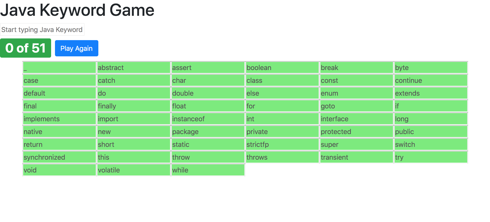

# Java Keyword Game

A game to practice learning all 51 Java keywords, written in AngularJS

## In This Document:

1. [Application URL](#application-url)
2. [How to Use the Application](#how-to-use-the-application)
3. [Technologies Used](#technologies-used)

## Application URL

[https://javakeywordgame.netlify.app/](https://javakeywordgame.netlify.app/)

## How to Use the Application

1. Start typing a Java keyword in the input field
2. As soon as you enter a valid keyword, it appears in the list and the input field clears for the next keyword you will enter
3. You win after you enter all Java keywords
4. In case you give up and want to reveal remaining keywords, click Reveal

## Technologies Used

  * AngularJS
  * HTML, CSS, Bootstrap, and JavaScript

[Up](README.md)

